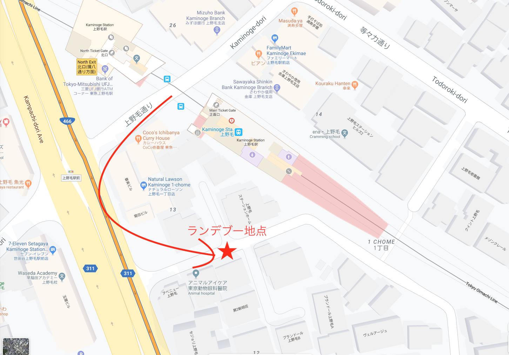

# 2020年2月 開発合宿 旅のしおり

## 概要

- 開始: 2020年2月8日(土) 11:00
- 終了: 2020年2月10日(月) 13:00
- 場所: [上郷・森の家](http://kamigo-morinoie.com/)(神奈川県横浜市)
- 連絡先： 045-895-5151
- 担当： フロント ヒラサワ様

### 広尾駅から現地へのアクセス

- 電車、バスで約1時間45分

## 開発チーム

| 氏名 | チーム名 | 開発内容 |
| ---- | ------ | ------ |
| 星野 友宏 |	大和田 | マッサージ予約システム |
| 北村 真悠 | 大和田 | マッサージ予約システム |
| 稲葉 健吾 | 無限コイン | 役に立たないアプリ |
| 多田 吉克 | 無限コイン | 役に立たないアプリ |
| 永島 翔太 | bootapp | 検討中 |
| 佐々木 翔平 | ラズパイ | 自宅エアコンの自動操作 |
| 早川 大貴 | メロン | 受注システム |
| 上屋 誠 | メロン | 受注システム |
| 塩田 剛 | コロッケ | 検討中 |
| 田平 良 | かわさき | 検討中 |

### コミュニケーションチャネル

- [ES開発合宿Slack](https://es-dev-camp.slack.com)に各チームのチャネルを作成

## タイムスケジュール

### 1日目(2/8)

- 11:00
  - 現地集合
- 12:00
  - 昼食
- 13:00
  - 買い出し
- 17:45
  - 進捗発表(1チーム2分)
- 18:00
  - 夕食

### 2日目(2/9)

- 07:00
  - 朝食
- 12:00
  - 昼食
- 17:00
  - 中間発表(1チーム5分)
- 18:00
  - 夕食

### 3日目(2/10)

- 07:00
  - 朝食
- 11:00
  - 成果発表(1チーム15分)
- 13:00
  - 現地解散

## 携行品

- 開発用PC
- 電源タップ
- ディスプレイ
- 着替え2日分
- 洗顔用タオル2日分
- 常備薬
- 他、生活必需品

## 支払

- チェックイン時に宿泊費を現金精算
- 21,870円/人
  - 最終的な参加人数によって増減あり
- メンバー追加時の料金
  - 8,950(2/8ピークシーズン料金) + 7,920(通常料金) = 16,870
  - 会議室レンタル料(40,000)は頭割り

## 客室

- 9人部屋(男性部屋)： 1
- 5人部屋(女性部屋)： 1

### 補足

- 料金は1名単位で計算、部屋の増減とは関係無し
- アメニティはスタンダードプラン相当
- 連泊のため、2日目の清掃は無しにした
- Wi-Fi 設備は会議室のみ

## 会議室

- プロジェクタ、ホワイトボード有り
- Wi-Fi 設備有り

## 食事

- 1Fのレストランでブッフェスタイル
  - メインのおかずは1品までとか制約があるらしいので当日聞く

## 風呂

- 初日の風呂時間は 16:30〜23:30

## 駐車場

- 車の場合は届け出れば減額適用
- バイクの場合は無料

### 車乗合

- 以下のメンバーは東急大井町線 上野毛駅に集合
  - 星野 友宏
  - 永島 翔太
  - 佐々木 翔平
  - 上屋 誠
  - 塩田 剛
- 集合時間 2/8(土) 09：40〜09:50
- 下図の位置に駐車して荷物を積み込み

